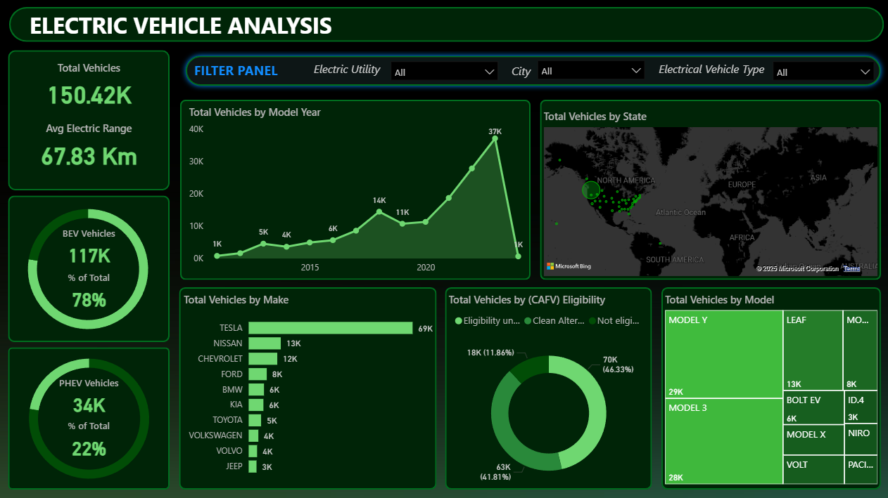

# Electric Vehicle Analysis Dashboard
 

> This dashboard provides actionable insights for strategic decision-making in the evolving electric vehicle landscape 

---

## 🎯 Problem Statement 

With the rapid growth of electric vehicle adoption globally, stakeholders—including policymakers, manufacturers, and environmental agencies—need clear insights into:

- Market penetration and growth trends
- Geographic distribution of EV adoption
- Vehicle performance characteristics (range, efficiency)
- Manufacturer market share
- Clean Alternative Fuel Vehicle (CAFV) eligibility

## My Role 👨‍💼

**Data Analyst & Dashboard Developer**
- Designed and developed an interactive Power BI dashboard
- Performed data cleaning, transformation, and validation
- Created visualizations to communicate complex data
- Implemented interactive filtering for enhanced user experience

## 📊 The Data

- **Total Records:** 150,420 electric vehicles
- **Time Period:** 2015–2025 (includes projections)
- **Geographic Scope:** Multiple states
- **Vehicle Types:** BEV and PHEV

**Key Data Points:**
- Vehicle make/model
- Electric range
- Model year
- Geographic location
- CAFV eligibility
- Utility provider

## 🔄 Process & Methodology

1. **Data Collection & Assessment:** Imported and assessed raw EV registration data.
2. **Data Cleaning & Transformation:** Standardized names, validated ranges, categorized types, cleaned geographic data.
3. **Dashboard Design & Development:** Built interactive filters, KPI cards, time-series and geographic visualizations.
4. **Testing & Validation:** Cross-referenced calculations, tested filters, validated insights.

## 🔍 Key Insights

- **Market Composition:** 78% BEV vs 22% PHEV; BEVs dominate with 117K units.
- **Average Range:** 67.83 km (combined; may reflect data limitations).
- **Market Leaders:** Tesla (69K, 45.9%), Nissan (13K), Chevrolet (12K), Ford (8K).
- **Peak Year:** 2020 with 37K new registrations.
- **Geographic Distribution:** State-wise variation, influenced by infrastructure and policy.
- **CAFV Eligibility:** 41.81% eligible, 11.86% not eligible, 46.33% unknown.
- **Popular Models:** Tesla Model Y (29K), Model 3 (28K), Nissan Leaf (13K).

## 🚧 Challenges Faced

- **Data Quality:** Inconsistent naming, missing values, geographic standardization.
- **Analytical:** CAFV classification, range calculation, temporal analysis.
- **Visualization:** Balancing information density, interactive design, performance optimization.

## 📚 What I Learned

- **Technical:** Advanced Power BI, DAX, data modeling, interactive design.
- **Domain:** EV market dynamics, regulatory frameworks, geographic patterns.
- **Best Practices:** Data validation, iterative design, performance optimization.
- **Business Intelligence:** Stakeholder communication, storytelling, actionable insights.

## 🛠️ Technologies Used

- **Power BI Desktop**
- **DAX**
- **Power Query**
- **Microsoft Excel**

